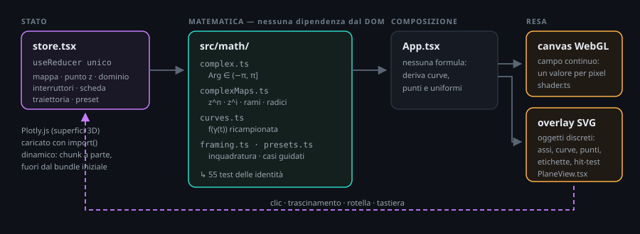

# Mappa interattiva — `z^n` e `z^i` nel browser

### 🌐 Online su **[www.wasef.it](https://www.wasef.it)** — non serve installare nulla per provarla

Applicazione web per esplorare le mappe complesse `z ↦ z^n` e `z ↦ z^i`: due
piani affiancati, ritratto di fase calcolato per pixel in WebGL, selezione del
punto con clic e trascinamento, pannello matematico completo, superfici 3D di
modulo e argomento, traiettorie animate, preimmagini e dieci casi guidati.

Le istruzioni qui sotto servono per eseguirla in locale o per modificarla.



---

## Indice

- [Avvio rapido](#avvio-rapido)
- [Scelta tecnologica](#scelta-tecnologica)
- [Guida all'uso](#guida-alluso)
- [Il ritratto di fase](#il-ritratto-di-fase)
- [Architettura](#architettura)
- [API matematica](#api-matematica)
- [Correzioni matematiche](#correzioni-matematiche)
- [Test e verifiche](#test-e-verifiche)
- [Configurazione](#configurazione)
- [Prestazioni](#prestazioni)
- [Distribuzione](#distribuzione)
- [Risoluzione dei problemi](#risoluzione-dei-problemi)

---

## Avvio rapido

Requisito: **Node.js 20 o successivo** (collaudato su 24.12).

```bash
cd interactive_map
npm install
npm run dev          # http://localhost:5173
```

| Comando | Effetto |
|---|---|
| `npm run dev` | server di sviluppo con ricarica a caldo |
| `npm run build` | controllo dei tipi + build di produzione in `dist/` |
| `npm run preview` | serve `dist/` in locale, come in produzione |
| `npm test` | 55 test delle identità matematiche (Vitest) |
| `npm run controlla` | solo controllo dei tipi TypeScript |
| `npm run confronta` | confronto numerico diretto col nucleo Python del video |
| `npm run verifica:ui` | 32 controlli funzionali end-to-end in Chrome headless |
| `npm run verifica` | tipi + test + confronto + verifica funzionale |

---

## Scelta tecnologica

**Scelto: Vite + React + TypeScript, con rendering ibrido WebGL 2 + SVG e
Plotly.js caricato in modo lazy per il 3D.**

Il vincolo dimensionante della specifica è il *ritratto di fase almeno 500×500
aggiornato a ogni interazione*, insieme a *clic e trascinamento su un piano
complesso*. Da lì discende tutto il resto.

| Alternativa | Click sul piano | Drag di un punto | Ritratto 500×500 interattivo | Distribuzione |
|---|---|---|---|---|
| **Streamlit + Plotly** | solo con `streamlit-plotly-events` (componente di terze parti, fragile) | non supportato | ogni interazione fa un rerun completo dello script lato server | serve un processo Python attivo |
| **Plotly Dash** | sì, via `clickData` | non supportato | ogni callback è un round-trip HTTP; la heatmap va ricodificata e ritrasferita a ogni fotogramma | serve un processo Python attivo |
| **Vite + React + TS** | nativo | nativo (Pointer Events) | shader GLSL: un valore per pixel, a 60 fps, nessun server | cartella statica |

Nelle prime due opzioni il ritratto di fase è un'immagine calcolata dal server e
spedita al client: trascinare un punto significherebbe rigenerare e ritrasferire
una bitmap decine di volte al secondo. Con uno shader, invece, `arg f(z)` e le
curve di livello di `|f(z)|` sono calcolate **direttamente sulla GPU per ogni
pixel**: la risoluzione effettiva coincide con quella del canvas — 603 px di
lato nella verifica automatica, oltre il minimo richiesto — e resta tale durante
zoom e trascinamento, a costo costante.

La divisione dei compiti fra le due tecnologie di resa è deliberata:

- il **canvas WebGL** disegna il campo continuo, dove serve un valore per pixel;
- l'**overlay SVG** disegna gli oggetti discreti (assi, griglie, curve, punti,
  etichette), dove servono tratti netti a qualunque zoom, hit-testing del
  puntatore e testo accessibile.

Mettere tutto su un solo canvas costringerebbe a reimplementare a mano
l'antialiasing del testo e la selezione dei punti.

**Il prezzo pagato** è più codice da scrivere e la logica matematica duplicata in
TypeScript. La duplicazione è però controllata: `src/math/complexMaps.ts`
rispecchia una a una le firme di `../video_animation/complex_maps.py`, e le due
suite di test verificano le **stesse identità analitiche**, così che le due
implementazioni non possano divergere in silenzio.

Plotly.js è usato solo per le superfici 3D, dove rotazione e proiezione delle
curve di livello sarebbero costose da riscrivere, ed è caricato con `import()`
dinamico: finisce in un chunk separato (4,6 MB) che non pesa sull'avvio.

---

## Guida all'uso

### Flusso tipico

1. Scegli la mappa: `z^n`, `z^i` (ramo principale) o `z^i rami`.
2. Clicca o trascina sul **piano del dominio** per scegliere `z`; in
   alternativa inserisci `Re z` e `Im z` nei campi numerici, oppure usa le
   frecce della tastiera dopo aver messo a fuoco il piano (`Shift` per passo
   fine).
3. Leggi il **pannello matematico** a destra: `z`, `|z|`, `Arg z` in radianti e
   gradi, `f(z)`, `|f(z)|`, `Arg f(z)`, la formula simbolica, le radici o i
   rami, e gli avvisi matematici.
4. Approfondisci nei pannelli a schede in basso.

### Controlli

| Controllo | Che cosa fa |
|---|---|
| Selettore mappa | `z^n`, `z^i` principale, `z^i` ramo `k` |
| Slider `n` | esponente intero da 2 a 10 |
| Slider `k` | ramo da −3 a 3 |
| Zoom + / − / Reset | finestra del dominio |
| Rotella sul piano del dominio | zoom continuo centrato sul puntatore. **Sopra il piano la pagina non scorre**: la rotella è dedicata allo zoom. Per scorrere la pagina, usare il puntatore fuori dai piani. Il piano immagine non è zoomabile, quindi lì la rotella scorre normalmente. |
| semilato | finestra del dominio per via numerica |
| stessa scala nei due piani | forza il piano immagine a usare la finestra del dominio |
| Re z / Im z | inserimento esatto del punto |
| cifre decimali | precisione dei pannelli, da 2 a 12 |
| densità griglie | numero di rette, cerchi e raggi |
| intensità bande | forza delle curve di livello del modulo |
| arcobaleno / alta leggibilità | due schemi di tinta |
| dieci interruttori | ritratto di fase, bande, settori, griglia polare, griglia cartesiana, curve immagine, punti campione, radici/rami, fibra del punto, taglio di ramo |

### Pannelli a schede

| Scheda | Contenuto |
|---|---|
| **Casi guidati** | Dieci preset che impostano mappa, punto, dominio e visualizzazioni, con la spiegazione del fenomeno. Sotto, una verifica numerica immediata dei valori notevoli. |
| **Ritratto di fase** | Ruota dei colori interattiva e legenda completa di come leggere tinta, bande, settori, zona esclusa e taglio. |
| **Modulo** | Superficie 3D o mappa 2D di `\|f(z)\|`, con scala logaritmica opzionale. |
| **Argomento** | Superficie 3D o mappa 2D di `Arg f(z)`, con le discontinuità lasciate aperte invece che raccordate. |
| **Traiettorie** | Sei curve `γ(t)` parametriche con un parametro libero, animazione, e il **numero di avvolgimenti** dell'immagine attorno all'origine. |
| **Preimmagini** | Si sceglie `w` cliccando sul piano immagine e si vedono comparire le preimmagini nel piano del dominio. |

### I dieci casi guidati

`i^i` · La circonferenza unitaria · Il semiasse reale positivo · Raggi ad
argomento costante · Cerchi a modulo costante · `z^i` non è iniettiva · Il salto
sul taglio di ramo · Le `n` radici `n`-esime · Avvolgimento `n` volte · La corona
immagine.

---

## Il ritratto di fase

Nel **piano del dominio** il colore del punto `z` descrive `f(z)`; nel **piano
immagine** il colore del punto `w` descrive `w` stesso, così da fare da
riferimento cromatico: lo stesso colore indica lo stesso valore nei due piani.

| Elemento visivo | Significato |
|---|---|
| Tinta | `arg f(z)`. Rosso = 0, verde-ciano ≈ `+2π/3`, blu-viola ≈ `−2π/3`. Un giro completo di tinte attorno a un punto segnala uno zero o un polo. |
| Bande chiaro/scuro | curve di livello di `\|f(z)\|`, in progressione geometrica di ragione 2. Bande fitte = modulo che varia rapidamente. |
| Settori di fase | dodici spicchi da `π/6`. Insieme alle bande formano un reticolo: dove i due si incontrano ad angolo retto, la mappa è conforme. |
| Grigio tratteggiato | regione esclusa vicino all'origine per `z^i` (vedi sotto). |
| Riga rossa tratteggiata | il taglio di ramo `(−∞, 0]`. |
| Cerchi tratteggiati nel piano immagine | `e^{−π}` ed `e^{π}`, i confini della corona immagine di `z^i`. |

**Come si legge lo scambio di ruoli.** Con `z^i` selezionata, il piano del
dominio mostra **anelli concentrici di tinta** (perché `arg f = ln|z|` dipende
solo dal modulo) e **settori angolari di luminosità** (perché `|f| = e^{−Arg z}`
dipende solo dall'argomento). Con `z^n` accade l'opposto: settori di tinta e
anelli di luminosità. È la differenza strutturale fra le due mappe, visibile a
colpo d'occhio.

---

## Architettura

```
interactive_map/
├── index.html
├── package.json · tsconfig.json · vite.config.ts
├── scripts/
│   └── verifica-ui.mjs          verifica end-to-end via Chrome DevTools Protocol
└── src/
    ├── main.tsx                 punto di ingresso
    ├── App.tsx                  composizione: deriva curve, punti e uniformi
    ├── styles.css
    ├── math/                    MATEMATICA — nessuna dipendenza da React
    │   ├── complex.ts           aritmetica complessa, Arg principale, formattazione
    │   ├── complexMaps.ts       z^n, z^i, rami, radici, corona, aliasing
    │   ├── curves.ts            famiglie di curve e loro immagini
    │   ├── framing.ts           inquadratura del piano immagine, proiezioni
    │   ├── presets.ts           i dieci casi guidati
    │   └── complexMaps.test.ts  55 test
    ├── render/
    │   └── shader.ts            GLSL del ritratto di fase + classe PhaseRenderer
    ├── components/
    │   ├── PlaneView.tsx        un piano: canvas WebGL + overlay SVG + interazione
    │   ├── Controls.tsx         barra dei controlli
    │   ├── PointPanel.tsx       pannello matematico del punto
    │   ├── SidePanels.tsx       legenda, traiettorie, preimmagini, casi guidati
    │   └── SurfacePanel.tsx     superfici 3D (Plotly, lazy)
    ├── state/
    │   └── store.tsx            un solo useReducer con contesto
    └── types/
        └── plotly.d.ts
```

La regola è rigida: **`src/math/` non importa nulla da React o dal DOM**, e
`App.tsx` non contiene formule. Si limita a derivare dallo stato le curve, i
punti e le uniformi dello shader, e a distribuirli.

Lo stato è un unico `useReducer` senza librerie esterne: è piccolo ma
fortemente accoppiato (cambiare mappa invalida il caso guidato attivo, cambiare
dominio invalida l'inquadratura dell'immagine), e un riduttore unico rende
queste dipendenze esplicite e verificabili.

---

## API matematica

Le firme corrispondono una a una a quelle Python di
`../video_animation/complex_maps.py`.

```ts
type Complex = { re: number; im: number };

// Argomento e logaritmo
argPrincipal(z): number                  // Arg z ∈ (−π, π], NaN in 0
wrapToPi(theta): number                  // riduce a (−π, π], manda −π in +π
principalLog(z): Complex                 // ln|z| + i·Arg z
computeLogBranches(z, kRange): Complex[] // log_k z = ln|z| + i(Arg z + 2πk)

// Potenza intera
mapZPower(z, n): Complex                 // z^n
derivativeZPower(z, n): Complex          // n·z^(n−1)
computeNthRoots(w, n): Complex[]         // le n preimmagini di w
indiceRadiceSelezionata(z, n): number    // quale radice è z

// Potenza immaginaria
mapZiPrincipal(z): Complex               // exp(i·Log z) = e^(−θ)·e^(i ln r)
mapZiBranch(z, k): Complex               // z^i · e^(−2πk)
derivativeZi(z): Complex                 // i·z^i / z
ziModulus(z): number                     // e^(−Arg z)
ziArgument(z, principale?): number       // ln|z|, ridotto o no
ziFiber(z, mRange): Complex[]            // {z·e^(2πm)}: la fibra

// Dominio e immagine
nearBranchCut(z, tol?): boolean
aliasingRadius(passo, faseMax?): number
imageAnnulus(dominio?): { rMin, rMax, rMinIncluso, rMaxIncluso }
injectivityAnnulus(z): { rMin, rMax }

// Costanti
E_MENO_PI   // 0.04321391826377226
E_PI        // 23.140692632779267
FATTORE_RAMO// 0.0018674427317079893  = e^(−2π)
I_ALLA_I    // 0.20787957635076193    = e^(−π/2)
```

Tutte restituiscono `NaN` sui punti non definiti anziché lanciare eccezioni;
sono i componenti di visualizzazione a trattare esplicitamente quel caso.

---

## Correzioni matematiche

Quattro punti in cui l'app si discosta — deliberatamente — da formulazioni
diffuse ma imprecise. Ciascuno è verificato da un test ed è illustrato da un
caso guidato.

**1. `z^i` non è iniettiva sul piano tagliato: è ∞-a-1.**
`z₁^i = z₂^i` equivale a `θ₁ = θ₂` e `ln r₁ − ln r₂ ∈ 2πℤ`, cioè
`z₂ = z₁e^{2πm}`. Controesempio: `1^i = (e^{2π})^i = 1`. Il ramo principale è
iniettivo solo su una corona di ampiezza `2π` in `ln|z|`, intersecata col piano
tagliato — corona che l'app calcola e mostra nel pannello del punto.
*Caso guidato «`z^i` non è iniettiva»; interruttore «Fibra del punto».*

**2. L'immagine è semiaperta su `ℂ∖{0}`, aperta su `ℂ∖(−∞,0]`.**
`|z^i| = e^{−Arg z}` con `Arg ∈ (−π, π]` dà `|w| ∈ [e^{−π}, e^{π})`: l'estremo
interno è attinto (in `z = −1`), quello esterno mai.
*Caso guidato «La corona immagine»; funzione `imageAnnulus`.*

**3. L'immagine della circonferenza unitaria è `[e^{−π}, e^{π})`, non chiusa.**
*Caso guidato «La circonferenza unitaria».*

**4. In `z = 0`, `z^i` oscilla, non diverge.**
Il modulo resta limitato in `[e^{−π}, e^{π})`; è l'argomento `ln r → −∞` a
oscillare. L'origine è un punto di diramazione, non un polo. Di conseguenza il
disco escluso vicino all'origine **non** serve contro un overflow, ma contro
l'**aliasing della fase**: `d(arg w)/dr = 1/r`, quindi il raggio critico è
`h/(π/2)` con `h` passo di campionamento, e l'app lo ricalcola a ogni zoom
invece di usare una costante fissa.

Due dettagli numerici: `Math.atan2(-0, -1)` vale `−π`, quindi `argPrincipal`
normalizza esplicitamente il semiasse reale negativo a `+π`; e l'immagine di una
curva che attraversa il taglio viene **spezzata** invece che raccordata, perché
unire i due lati con un segmento disegnerebbe una corda che non appartiene
all'immagine della curva.

---

## Test e verifiche

### Test matematici (Vitest) — 55 casi

```bash
npm test
```

Verificano le identità, non la semplice esecuzione del codice: `|z^n| = |z|^n`,
`arg(z^n) ≡ n·arg z`, `exp(log_k z) = z` per ogni ramo, somma nulla e prodotto
`(−1)^{n+1}w` delle radici, `|z^i| = e^{−Arg z}` costante lungo ogni raggio,
`arg(z^i) = ln|z|` costante su ogni cerchio, il salto `e^{2π}` sul taglio, il
rapporto `e^{−2π}` fra rami consecutivi, l'iniettività sulla corona e la sua
assenza fuori, `i^i = 0.20787957635076193`, e il comportamento oscillante — non
divergente — vicino all'origine.

### Confronto col nucleo Python — 819 valori

```bash
npm run confronta
```

Le due suite di test verificano le stesse identità, ma questo non basta: due
implementazioni possono soddisfare le medesime identità e restituire numeri
diversi — per esempio scegliendo un diverso rappresentante dell'argomento.
Questo script chiude il buco eseguendo **entrambi i nuclei sugli stessi 21
punti** e confrontando valore per valore `arg_principal`, `principal_log`,
`map_z_i_principal`, `z_i_modulus`, `z_i_argument`, `derivative_z_i`,
`map_z_power` per `n ∈ {2,3,5,10}`, `map_z_i_branch` per `k ∈ {−2,…,2}`, le
cinque radici quinte e la corona di iniettività.

Il modulo TypeScript viene transpilato al volo con esbuild, già presente come
dipendenza di Vite: nessun pacchetto aggiuntivo. Richiede il venv di
`../video_animation`, oppure un interprete indicato con `PYTHON=...`.

### Verifica funzionale (Chrome DevTools Protocol) — 32 controlli

```bash
npm run dev        # in un terminale
npm run verifica:ui # in un altro
```

Avvia Chrome headless, carica l'app e la pilota davvero: clic e trascinamento
sui piani, slider, interruttori, zoom, schede, preset. Controlla sia i comandi
sia i **valori matematici mostrati a schermo** — per esempio che `z = i` dia
`0,2079 + 0,0000 i`, che `z = −1` dia `|f(z)| = 0,0432`, che la circonferenza
unitaria avvolga `0` volte l'origine sotto `z^i` e `3` volte sotto `z^3`.

Non richiede alcuna dipendenza aggiuntiva: Node 22+ espone `fetch` e `WebSocket`
come globali, quindi niente Playwright o Puppeteer. Chrome viene cercato nei
percorsi consueti; in alternativa si indica con la variabile `CHROME`, e
`MOSTRA=1` lo apre con la finestra visibile per guardare la verifica in azione.

L'ultima esecuzione completa: **55/55 test matematici, 819/819 valori coincidenti
col nucleo Python, 32/32 controlli funzionali, nessun errore JavaScript, WebGL
attivo anche senza GPU** (rasterizzatore software SwiftShader).

---

## Configurazione

### Dominio e risoluzione

Il dominio predefinito è `[−3, 3] × [−3, 3]`, in `src/state/store.tsx`:

```ts
const DOMINIO_PREDEFINITO: Rettangolo = { xMin: -3, xMax: 3, yMin: -3, yMax: 3 };
```

La risoluzione del ritratto di fase **non è un parametro**: coincide con quella
del canvas, che si adatta al contenitore e al `devicePixelRatio` (limitato a 2
in `PhaseRenderer.ridimensiona`, per non quadruplicare i pixel sui monitor ad
alta densità senza guadagno visibile).

La risoluzione delle superfici 3D è `RISOLUZIONE = 121` in `SurfacePanel.tsx`
(14 641 punti): oltre, Plotly diventa lento a ruotare.

### Inquadratura del piano immagine

`dominioImmagine` in `src/math/framing.ts` stima la finestra campionando la
mappa su una griglia 48×48 e prendendo il quantile 0,985 del modulo, poi
arrotondato a un valore leggibile. Il quantile serve a evitare che pochi pixel
agli angoli del dominio — dove `z^10` arriva a `2,4·10⁷` — comprimano tutto il
resto in un punto. L'interruttore «stessa scala nei due piani» disattiva la
stima e usa la finestra del dominio.

### Schemi di colore

Lo schema «alta leggibilità» ridistribuisce la tinta con una curva monotona
(`tintaCorretta` nello shader) che allarga arancio e ciano e restringe verde e
magenta, migliorando la distinguibilità rispetto all'arcobaleno HSV puro.

---

## Prestazioni

| Voce | Misura |
|---|---|
| Bundle iniziale | 207 kB (67 kB gzip) |
| Chunk Plotly | 4,67 MB (1,42 MB gzip), caricato solo all'apertura dei pannelli 3D |
| CSS | 8,2 kB (2,3 kB gzip) |
| Ritratto di fase | un `drawArrays` per fotogramma, costo indipendente dalla complessità della mappa |
| Curve | ricalcolate solo quando cambiano dominio, densità o mappa (`useMemo`) |
| Superfici 3D | 121×121 punti, ricalcolate solo al cambio di mappa o dominio |

Le curve sono memoizzate separatamente dal punto selezionato: trascinare `z`
aggiorna soltanto i punti e il pannello, non le ~170 polilinee.

---

## Distribuzione

```bash
npm run build     # produce dist/
npm run preview   # verifica dist/ in locale
```

`vite.config.ts` imposta `base: "./"`, quindi `dist/` funziona ovunque: aperta
da file system, servita da una sottocartella arbitraria, o pubblicata su
qualunque hosting statico.

```bash
npx serve dist                      # un server statico qualsiasi
python -m http.server --directory dist 8000
```

Non c'è alcun backend: tutto il calcolo avviene nel browser.

---

## Risoluzione dei problemi

| Sintomo | Causa | Rimedio |
|---|---|---|
| «WebGL2 non disponibile» nel piano | GPU disabilitata o driver vecchio | l'app resta usabile: curve, punti e pannelli funzionano, manca solo il campo colorato. In Chrome verificare `chrome://gpu` |
| Ritratto di fase a bande fittissime | dominio molto ampio con `z^i` | è corretto: `arg(z^i) = ln\|z\|` compie moltissimi giri. L'avviso in sovrimpressione lo segnala |
| Zona grigia tratteggiata vicino all'origine | soglia di aliasing della fase | aumentare lo zoom: la soglia si riduce automaticamente con la finestra |
| I pannelli 3D restano vuoti | Plotly non caricato | controllare la rete nella scheda Network; il chunk è ~4,7 MB al primo accesso |
| `npm run verifica:ui` non trova Chrome | percorso non standard | `CHROME="/percorso/chrome" npm run verifica:ui` |
| `npm run verifica:ui` fallisce tutto | server di sviluppo non avviato | lanciare prima `npm run dev`, oppure `URL_APP=http://localhost:4173/ npm run verifica:ui` dopo `npm run preview` |
| Le curve immagine appaiono spezzate | la curva attraversa il taglio di ramo | è il comportamento corretto: i due lati del taglio differiscono di un fattore `e^{2π}` e non vanno raccordati |
| Trascinamento a scatti con densità alta | troppe polilinee da ridisegnare | abbassare «densità griglie», o spegnere la griglia cartesiana |
| La rotella zooma il piano **e** fa scorrere la pagina | l'ascoltatore `wheel` è passivo | è la regressione risolta registrando l'ascoltatore a mano con `{ passive: false }` in `PlaneView.tsx`: l'`onWheel` di React è sempre passivo e il suo `preventDefault()` viene ignorato. Il controllo automatico che lo verifica è in `verifica-ui.mjs` |
| Non riesco a scorrere la pagina col puntatore sul piano | comportamento voluto | scorrere con il puntatore sui controlli, sul pannello di destra o sulle schede |

---

## Rapporto con il video

`../video_animation/` contiene le stesse definizioni e le stesse quattro
correzioni, implementate in Python per Manim. I due nuclei matematici sono
indipendenti ma verificati contro le medesime identità: il video espone il
ragionamento in forma lineare, l'app permette di verificarlo su qualunque punto.
